# Gym Fitness Application

An Android gym management and fitness tracking app built with **Kotlin** and **Firebase Realtime Database**. It has two sides: a **member app** (workouts, attendance, nutrition, step tracking) and an **admin / trainer panel** (members, attendance, workouts, equipment, diet plans).

Developed as my BCA Semester 6 major project at Narmada College (VNSGU), Surat.

## Screenshots

### Member app

| Sign up | User login | Home dashboard | Check-in |
|---|---|---|---|
| 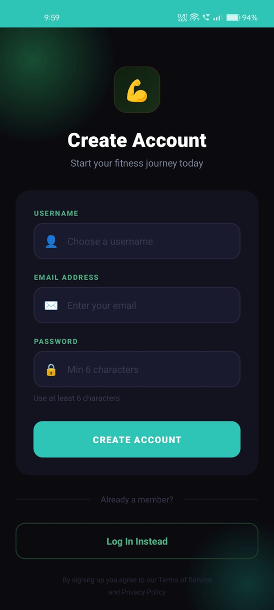 | 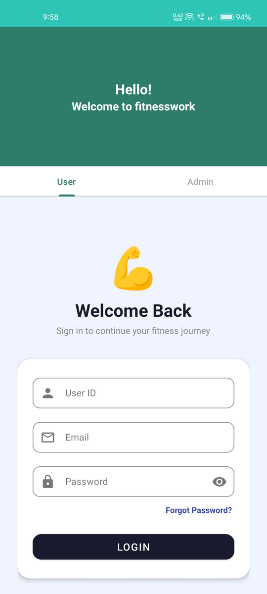 | 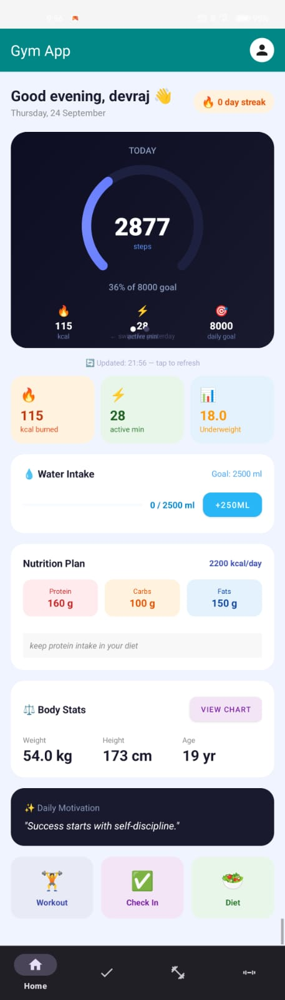 | 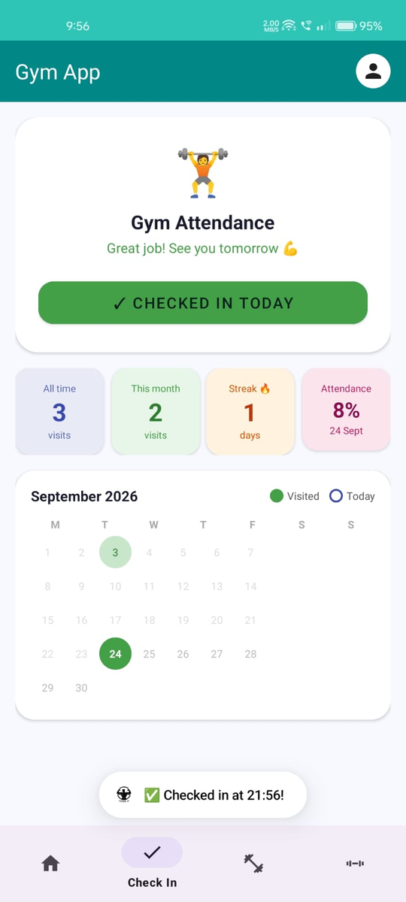 |

| Workouts | Workout detail | Equipment | Profile |
|---|---|---|---|
| 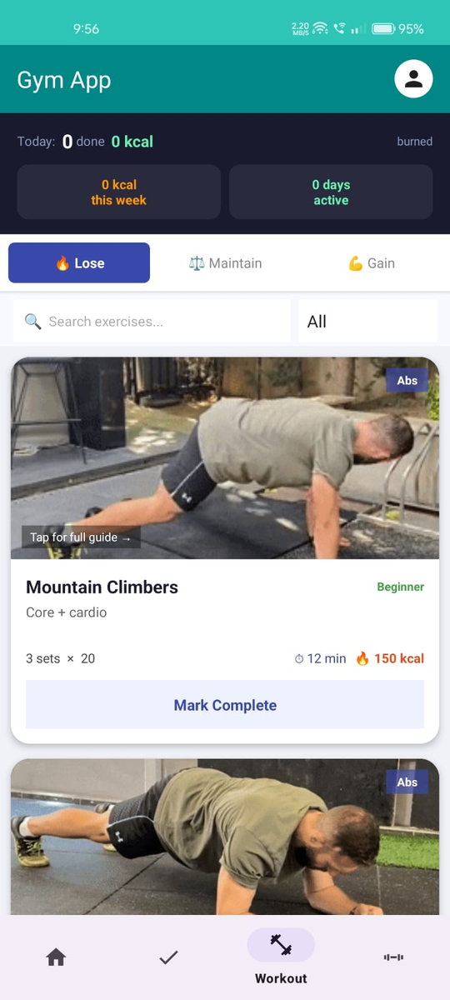 | 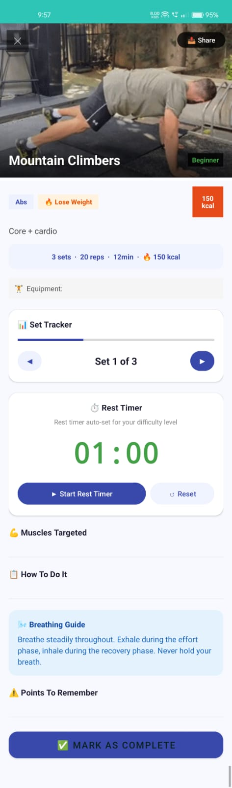 | 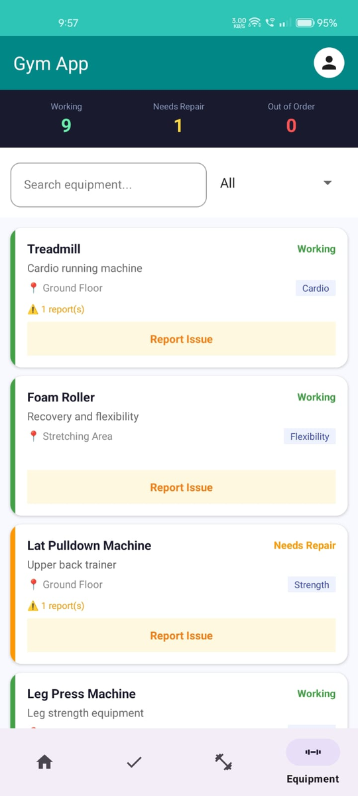 | 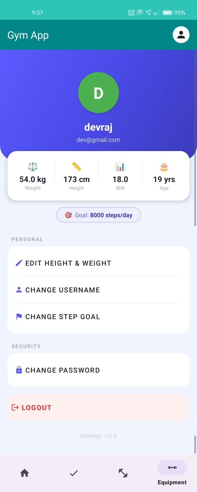 |

### Admin / trainer panel

| Admin login | Attendance | Manage workouts | Edit workout |
|---|---|---|---|
| 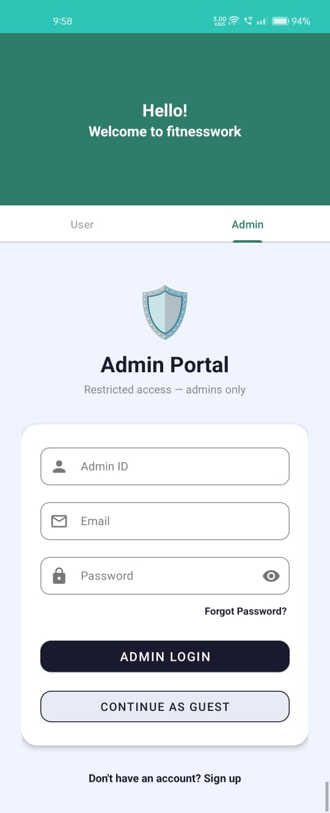 | 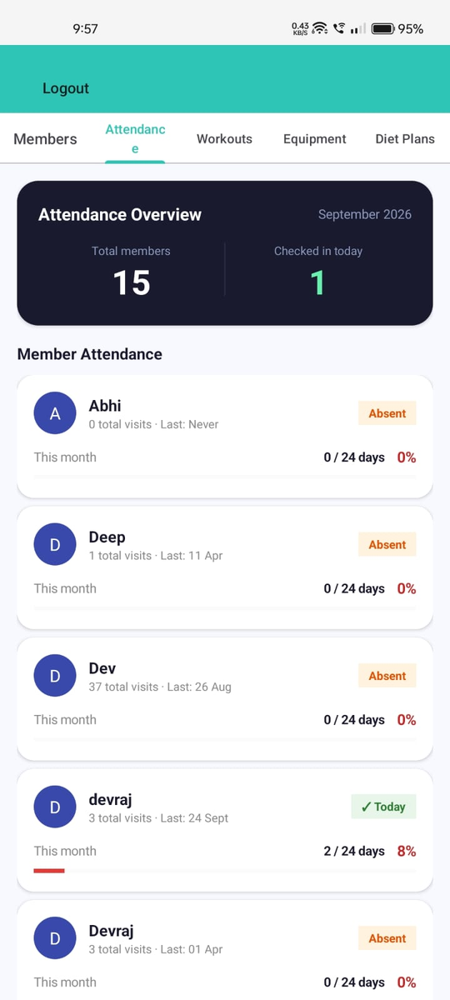 | 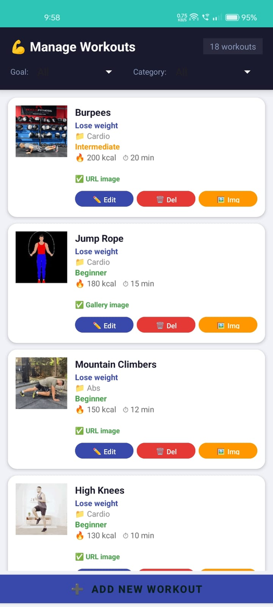 | 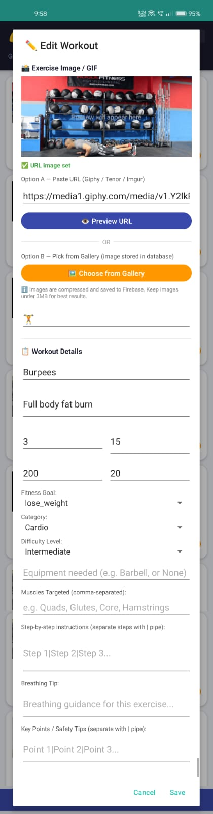 |

| Equipment manager | Diet plans | Assign diet plan |
|---|---|---|
| 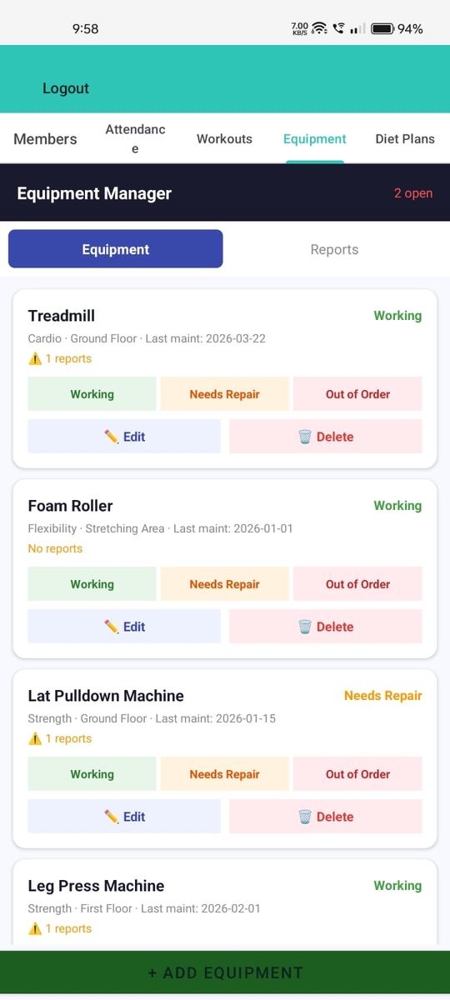 | 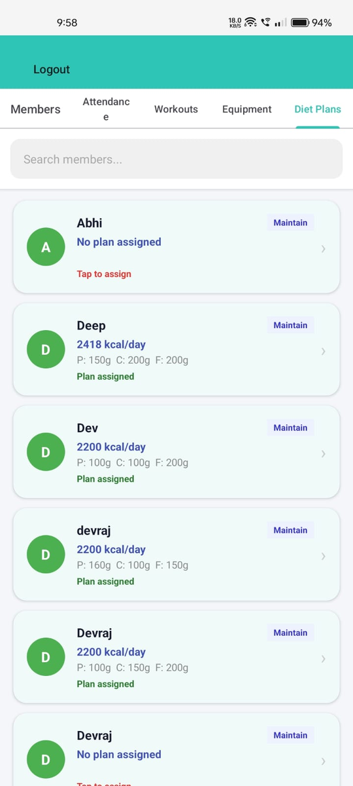 | 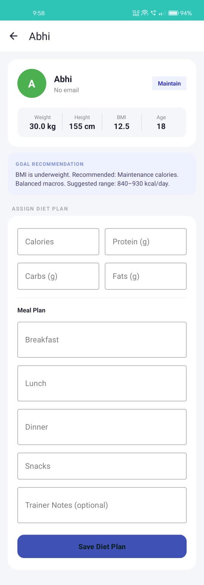 |

## Features

### Member app

- **Accounts:** sign up with username, email and password (minimum 6 characters), log in, forgot password, change password, change username, and a guest mode.
- **Home dashboard:** daily step counter with a progress ring towards the step goal, calories burned, active minutes, BMI with a category label, water intake tracker (+250 ml, 2500 ml goal), the nutrition plan assigned by the trainer, body stats with a chart, a daily motivation quote, and shortcuts to workouts, check-in and diet.
- **Step tracking:** reads daily steps, calories and active minutes through **Health Connect**; the step goal can be changed from the profile.
- **Gym attendance:** one-tap daily check-in with a monthly calendar of visited days, and stats for all-time visits, this-month visits, current streak and attendance percentage.
- **Workouts:** exercises grouped by fitness goal (Lose / Maintain / Gain), with search and category filters. Each card shows an animated GIF, sets and reps, duration, calories and difficulty. A weekly summary shows calories burned and active days.
- **Workout detail:** set tracker, rest timer that adapts to the difficulty level, muscles targeted, step-by-step instructions, a breathing guide, safety tips, share button, and "Mark as complete".
- **Equipment:** live status of gym equipment (working / needs repair / out of order), search and category filters, and a **Report issue** option for members.
- **Profile:** weight, height, BMI, age and step goal, with options to edit height and weight.

### Admin / trainer panel

- **Admin login:** separate tab with Admin ID, email and password.
- **Members:** searchable list of all members.
- **Attendance overview:** total members, members checked in today, and per-member visits, last visit date and monthly attendance percentage.
- **Workout management:** add, edit and delete workouts. Exercise images can be set from a URL (Giphy, Tenor or Imgur) or picked from the gallery (compressed and stored in Firebase). Fields include goal, category, difficulty, sets, reps, calories, duration, equipment, muscles targeted, instructions, breathing tip and safety tips.
- **Equipment manager:** add, edit and delete equipment, update its status (working / needs repair / out of order), track last maintenance date, and review issues reported by members.
- **Diet plans:** see which members have a plan, get a BMI-based goal recommendation with a suggested calorie range, and assign calories, macros (protein, carbs, fats), a meal plan (breakfast, lunch, dinner, snacks) and trainer notes.

## Tech Stack

| Area | Technology |
|---|---|
| Language | Kotlin |
| IDE | Android Studio |
| Backend / database | Firebase Realtime Database |
| Health data | Health Connect API |
| Build system | Gradle (Kotlin DSL) |
| UI | Android Views (XML layouts), Material components |

## Project Structure

```
Gymapplication/
├── app/
│   └── src/main/
│       ├── java/          # Activities, fragments, adapters and data models
│       └── res/           # Layouts, drawables, menus and values
├── gradle/                # Gradle wrapper and version catalog
├── build.gradle.kts
└── settings.gradle.kts
```

## Setup

1. Clone the repository:
   ```
   git clone https://github.com/VashiDevraj/gym-fitness-app.git
   ```
2. Open the project in Android Studio and let Gradle sync.
3. Create your own Firebase project and register an Android app with this project's package name.
4. In the Firebase console, create a **Realtime Database** and enable the sign-in method the app uses.
5. Download `google-services.json` from Firebase and place it in the `app/` folder. It is not included in this repository.
6. Make sure Health Connect is available on the device (it is built into Android 14 and later; older versions need the Health Connect app from Google Play).
7. Run the app on an emulator or a physical device.

## What I Learned

- Building a multi-screen Android app in Kotlin with fragments, tabs and bottom navigation.
- Designing a Firebase Realtime Database structure for members, attendance, workouts, equipment and diet plans.
- Separating member and admin features in one app.
- Reading fitness data with Health Connect and handling permissions.
- Handling images (URL or compressed gallery images) and secrets when sharing code publicly.

## Author

**Devraj Vashi**: BCA graduate (2026), aspiring MSc student in Computer Science / AI / Data Science.
GitHub: [@VashiDevraj](https://github.com/VashiDevraj)

## License

Copyright (c) 2026 Devraj Vashi. All rights reserved.
This code is shared for viewing and evaluation only. Copying, modifying, or redistributing it without written permission is not allowed.
